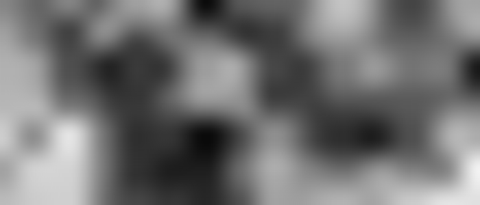

# 2D Perlin Noise Header File

Simple headerfile for 2d perlin noise (perlin.h).
### Example
To help understand the headerfile, example.c has been provided. 
The program uses [stb_image](https://github.com/nothings/stb) to create an example perlin noise image (see above).